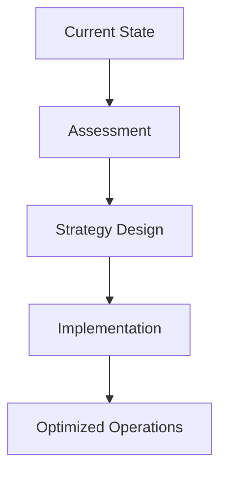

## Overview

Aagnia Technologies delivers comprehensive IT solutions that propel your business forward. You gain access to custom software development, robust web and mobile applications, seamless industrial IoT integrations, cutting-edge AI innovations, and expert consulting services. These offerings address your enterprise challenges with scalable, secure architectures designed for long-term success.

<Callout kind="info">
Aagnia focuses on end-to-end delivery, from problem conceptualization to deployment and maintenance.
</Callout>

## Core Services

Explore Aagnia's key services through these feature cards. Each solution is tailored to your specific industry needs.

<Columns cols={3}>
  <Card title="Custom Software Development" icon="code" href="#custom-software">
    Build bespoke applications that align perfectly with your business logic and workflows.
  </Card>
  <Card title="Web & Mobile Apps" icon="smartphone" href="#web-mobile">
    Create responsive web platforms and native mobile experiences for global reach.
  </Card>
  <Card title="Industrial IoT" icon="settings" href="#iot">
    Integrate sensors and devices for real-time monitoring and automation in manufacturing.
  </Card>
  <Card title="AI-Driven Solutions" icon="zap" href="#ai">
    Leverage machine learning models for predictive analytics and intelligent automation.
  </Card>
  <Card title="Consulting & Transformation" icon="trending-up" href="#consulting">
    Get strategic guidance to modernize your IT infrastructure and operations.
  </Card>
</Columns>

## Service Deep Dive

<Tabs>
  <Tab title="Web & Mobile" icon="smartphone">
    Develop cross-platform applications using modern frameworks like React Native for mobile and Next.js for web. You achieve native performance with a single codebase.

    ```javascript
    // Example: React Native component for Aagnia mobile SDK
    import { AagniaSDK } from '@aagnia/mobile-sdk';

    const App = () => {
      const initAagnia = async () => {
        await AagniaSDK.initialize({ apiKey: 'YOUR_API_KEY' });
      };

      useEffect(() => {
        initAagnia();
      }, []);

      return <AagniaDashboard />;
    };
    ```
  </Tab>

  <Tab title="Industrial IoT" icon="settings">
    Connect your industrial devices to cloud platforms for data-driven insights. Use MQTT protocols for efficient communication.

    <CodeGroup tabs="Node.js,Python">
    ````javascript
    const mqtt = require('mqtt');
    const client = mqtt.connect('mqtt://api.example.com:1883');

    client.on('connect', () => {
      client.subscribe('aagnia/iot/sensor/#');
      client.publish('aagnia/iot/sensor/temperature', '25.5');
    });
    ````
    ````python
    import paho.mqtt.client as mqtt

    client = mqtt.Client()
    client.connect("api.example.com", 1883, 60)
    client.subscribe("aagnia/iot/sensor/#")
    client.publish("aagnia/iot/sensor/temperature", "25.5")
    ````
    </CodeGroup>
  </Tab>

  <Tab title="AI Innovations" icon="zap">
    Deploy AI models for anomaly detection and forecasting. Integrate with TensorFlow or PyTorch via Aagnia's API.

    ```python
    import requests

    response = requests.post(
      'https://api.example.com/v1/ai/predict',
      headers={'Authorization': 'Bearer YOUR_TOKEN'},
      json={'data': [23.5, 24.1, 25.0]}
    )
    print(response.json()['prediction'])
    ```
  </Tab>
</Tabs>

## Getting Started with Aagnia Services

Follow these steps to initiate your project with Aagnia.

<Steps>
  <Step title="Assess Needs" icon="search">
    Identify your challenges in software, IoT, or AI.
  </Step>
  <Step title="Schedule Consultation" icon="calendar">
    Contact our team via `https://dashboard.example.com/contact`.
  </Step>
  <Step title="Prototype Development" icon="code">
    Review the custom prototype built to your specs.
  </Step>
  <Step title="Deploy & Scale" icon="rocket">
    Launch with ongoing support and monitoring.
  </Step>
</Steps>

## Consulting and Digital Transformation

<Expandable title="Advanced Transformation Strategies" default-open="true">
Aagnia's consulting goes beyond code—it reshapes your operations. You receive architecture audits, migration plans to cloud-native setups, and ROI-focused roadmaps.


</Expandable>

<Callout kind="tip">
Start with a free consultation to uncover quick wins in your IT stack.
</Callout>

## Next Steps

<Columns cols={2}>
  <Card title="Request Demo" icon="play-circle" href="https://dashboard.example.com/demo">
    See Aagnia solutions in action tailored to your use case.
  </Card>
  <Card title="View Case Studies" icon="book-open" href="#case-studies">
    Read success stories from enterprises like yours.
  </Card>
</Columns>